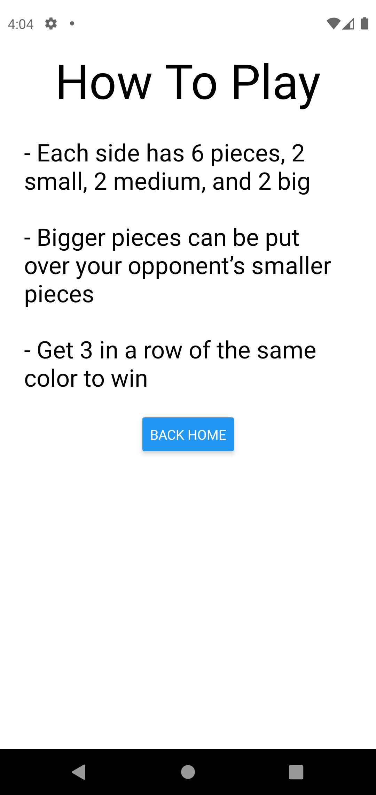

#  UpgradedTicTacToe

Mobile app created with React Native and Expo.
Game based off this [video](https://www.reddit.com/r/nextfuckinglevel/comments/nkupcu/upgraded_tic_tac_toe/).

# Rules of the game:
 - Each side has 6 pieces, 2 small, 2 medium, and 2 big
 - Bigger pieces can be put over your opponent’s smaller pieces
 - Get 3 in a row of the same color to win

# Gallery
 
 

  </td>
  
  
  

[comment]: <> (https://stackoverflow.com/questions/24319505/how-can-one-display-images-side-by-side-in-a-github-readme-md#:~:text=%23%23%23%23%20Flutter%20App%20Screenshots,td%3E%0A%20%20%3C/tr%3E%0A%20%3C/table%3E    image formatting)
